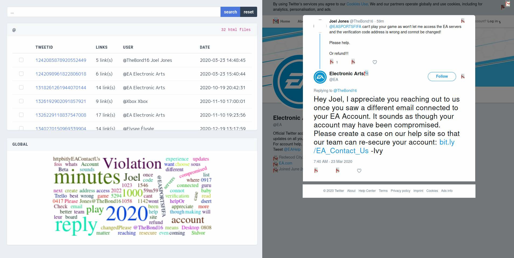

<div align="center"><h1>twayback-player</h1><div>
 
 
</div>
<hr>
  <b>a simple web interface to analyze html files from <a href="https://github.com/Mennaruuk/twayback" target="_blank">twayback</a></b>.
<p>(optimized for firefox)</p>
<p align="center">
  <a href="#install">Install</a> |
  <a href="#use">Use</a> |
  <a href="#depends">Depends</a>
</p>
<br>

</div>
<br>

## install 

From source :

```console
user@debian:~$ tar -xvf twayback-player-master.tar.gz
user@debian:~$ npm link twayback-player-master
```

then for uninstall :

```console
user@debian:~$ npm unlink twayback-player-master
```

## use

```console
Usage: twayback-player [options]

Options:
  -V, --version      output the version number
  -p  --path <path>  full path to twayback folder results
  -h, --help         display help for command
```

## depends

[nodejs and npm](https://nodejs.org/en/)
